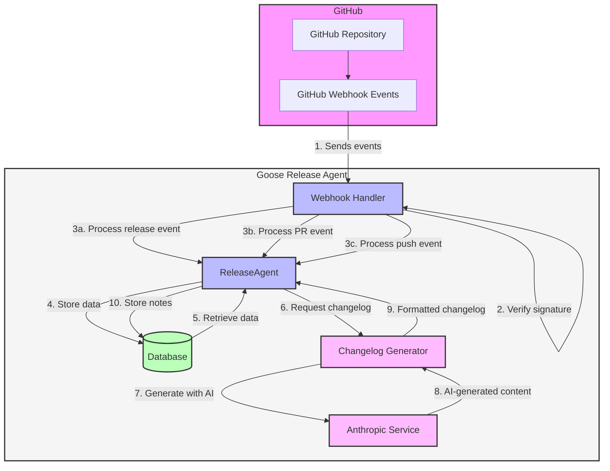

# 🪿 Goose Release Agent

A powerful agent-based backend system built on the HONC stack (Hono, OTEL, Nameyourdatabase, Cloudflare). This system leverages Cloudflare Workers, Durable Objects, and D1 to create stateful, real-time agent interactions through both WebSocket and REST API interfaces.

## Features

- **Stateful Agents**: Persistent agent instances powered by Cloudflare Durable Objects
- **Real-time Communication**: WebSocket support for interactive agent sessions
- **REST API**: Clean HTTP endpoints for simple agent interactions
- **Modular Architecture**: Easily extend with new agent types
- **SQLite Storage**: Built-in state persistence through Durable Objects
- **TypeScript**: Fully typed codebase for better development experience

## Architecture

The codebase is organized into a clean, modular structure:

```
src/
├── agents/                  # Agent implementations
│   ├── index.ts             # Re-exports all agents
│   ├── ChatAgent.ts         # Chat agent implementation 
│   ├── AssistantAgent.ts    # Assistant agent implementation
│   └── ReleaseAgent.ts      # Release notes generator agent
├── db/                      # Database definitions
│   └── schema.ts            # Drizzle ORM schema definitions
├── services/                # Service modules
│   ├── github.ts            # GitHub API integration service
│   ├── webhook-handler.ts   # GitHub webhook event processor
│   └── changelog-generator.ts # AI-powered changelog generator
├── types.ts                 # Shared type definitions
├── utils/                   # Utility functions
│   ├── index.ts             # Re-exports all utilities
│   └── agentUtils.ts        # Agent communication utilities
└── index.ts                 # Main application entry point with API routes
```

## Release Notes Generation

The ReleaseAgent is designed to automate the generation of release notes by processing GitHub webhook events and using AI to create structured, meaningful changelogs. Here's how it works:



### Flow Explanation:

1. **GitHub Webhook Events**: When activities occur in your GitHub repository (releases published, PRs merged, commits pushed), GitHub sends webhook events to your application.

2. **Webhook Handler**: Validates the request signature using your GitHub webhook secret and processes different event types.

3. **Event Processing**:
   - **Release Events**: When a new release is created/published on GitHub
   - **Pull Request Events**: When PRs are opened, closed, or merged
   - **Push Events**: When commits are pushed to the repository

4. **Data Storage**: The ReleaseAgent stores releases, pull requests, commits, and their relationships in the database.

5. **Changelog Generation**: When requested, the system:
   - Retrieves the release and its associated PRs and commits
   - Categorizes changes based on PR labels or commit messages
   - Uses the Anthropic Claude API to generate well-structured release notes
   - Returns formatted changelogs (Markdown, HTML, or JSON)

This automated process ensures your release notes are consistently formatted, include all relevant changes, and provide meaningful context for users.

## Getting Started

### Prerequisites

- [Node.js](https://nodejs.org/) (v18+)
- [pnpm](https://pnpm.io/installation) package manager
- [Cloudflare account](https://dash.cloudflare.com/sign-up) for deployment

### Local Development

1. **Clone the repository**:

```sh
git clone <repository-url>
cd goose-release-agent
```

2. **Install dependencies**:

```sh
pnpm install
```

3. **Set up environment variables**:

Create a `.dev.vars` file based on the provided example:

```sh
cp .dev.vars.example .dev.vars
# Edit .dev.vars with your values
```

4. **Set up the database**:

```sh
# This will create the local database, run migrations, and seed the database
pnpm run db:setup
```

5. **Start the development server**:

```sh
pnpm run dev
```

## Interacting with Agents

The project includes two agent types:

- **ChatAgent**: Handles conversational interactions
- **AssistantAgent**: Provides assistant-style responses

### HTTP Endpoints

#### ChatAgent:

```sh
# GET request
curl "http://localhost:8787/chat?message=Hello%20world"

# POST request
curl -X POST http://localhost:8787/chat \
  -H "Content-Type: application/json" \
  -d '{"message":"Hello via POST request"}'
```

#### AssistantAgent:

```sh
# GET request
curl "http://localhost:8787/assistant?query=What%20time%20is%20it"

# POST request
curl -X POST http://localhost:8787/assistant \
  -H "Content-Type: application/json" \
  -d '{"query":"What is the weather like?"}'
```

#### ReleaseAgent:

```sh
curl -X POST http://localhost:8787/releases \
  -H "Content-Type: application/json" \
  -d '{
    "version": "1.0.0",
    "repository": "owner/repo",
    "name": "First Official Release",
    "description": "This release includes several new features and bug fixes."
  }'
  ```

### GitHub Webhook Integration

The system provides automatic release notes generation through GitHub webhooks. When configured, it will:

1. Automatically detect new GitHub releases
2. Collect associated pull requests and commits
3. Categorize changes based on PR labels
4. Generate structured release notes

#### Setting Up GitHub Webhooks

1. **Configure environment variables**:

Add the following to your `.dev.vars` file:
```
GITHUB_API_TOKEN="your_github_personal_access_token"
GITHUB_WEBHOOK_SECRET="your_webhook_secret_here"
```

2. **Create a GitHub webhook**:
   
   - Go to your GitHub repository → Settings → Webhooks → Add webhook
   - Set Payload URL to: `https://your-worker-url.workers.dev/webhooks/github`
   - Content type: `application/json`
   - Secret: Same value as `GITHUB_WEBHOOK_SECRET`
   - Events: Select `Releases`, `Pull requests`, and `Pushes`

3. **Testing locally with ngrok**:

   To test webhooks locally, you can use [ngrok](https://ngrok.com/):
   ```sh
   ngrok http 8787
   ```
   Then use the ngrok URL for your GitHub webhook.

#### Webhook Payload Structure

The webhook endpoint (`/webhooks/github`) accepts the following events:

- **Release events**: Triggered when a release is published, created, or edited
- **Pull request events**: Tracks merged PRs to associate with releases
- **Push events**: Collects commits to provide detailed change information

#### Manual Testing

You can manually test the webhook with curl:

```sh
# Test a release event
curl -X POST http://localhost:8787/webhooks/github \
  -H "Content-Type: application/json" \
  -H "X-GitHub-Event: release" \
  -H "X-GitHub-Delivery: test-id" \
  -H "X-Hub-Signature-256: sha256=<generated-signature>" \
  -d '{
    "action": "published",
    "release": {
      "id": 12345,
      "tag_name": "v1.0.0",
      "name": "Release 1.0.0",
      "body": "Initial release"
    },
    "repository": {
      "id": 54321,
      "full_name": "owner/repo",
      "name": "repo",
      "owner": {
        "login": "owner"
      },
      "default_branch": "main"
    }
  }'
```

To generate a valid signature for testing, first make sure your `.dev.vars` file includes the webhook secret:

```
# In .dev.vars
GITHUB_WEBHOOK_SECRET="your_webhook_secret_here"
GITHUB_API_TOKEN="your_github_api_token_here"
```

Then use the included test script, which will automatically use the secret from your `.dev.vars` file:

```sh
# Make the script executable
chmod +x test-webhook.sh

# Run the test webhook script (uses secret from .dev.vars)
./test-webhook.sh

# Test different event types
./test-webhook.sh "" pull_request
./test-webhook.sh "" push
```

The script automatically:
1. Creates an appropriate payload for the event type
2. Generates a valid HMAC SHA-256 signature using your webhook secret
3. Sends the webhook to your local server with test_mode=true

> **Note**: The test_mode parameter prevents making real GitHub API calls, allowing you to
> test the webhook endpoint safely without requiring valid GitHub credentials.

Alternatively, you can use the Node.js script for more detailed signature generation:

```sh
# Make the script executable
chmod +x generate-signature.js

# Generate a signature for a JSON file
./generate-signature.js < test-payload.json

# Or provide a specific webhook secret
./generate-signature.js "your_secret" < test-payload.json
```

To generate a valid signature, you can use a tool like [webhook-signature-generator](https://webhook.site/webhook-signature-generator).

#### Successful Test Responses

When testing webhooks in test mode, you should see responses like:

```json
// For release events
{
  "success": true,
  "event": "release",
  "action": "published",
  "result": {
    "status": "test_mode_success",
    "message": "Successfully processed test webhook for release.published"
  }
}

// For pull request events
{
  "success": true,
  "event": "pull_request",
  "action": "closed",
  "result": {
    "status": "test_mode_success",
    "message": "Successfully processed test webhook for pull_request.closed"
  }
}
```

#### How the Webhook Handler Works

The GitHub webhook integration is implemented with a clean, modular architecture:

1. **GitHub Service** (`src/services/github.ts`)
   - Handles all direct GitHub API interactions
   - Verifies webhook signatures for security
   - Fetches repository, release, PR, and commit data
   - Provides typed interfaces for GitHub API responses

2. **Webhook Handler** (`src/services/webhook-handler.ts`)
   - Processes GitHub webhook events
   - Stores data in the D1 database
   - Associates PRs with releases
   - Triggers release notes generation

3. **Event Processing Flow**:
   - **Release events**: When a release is published or created, the handler stores its information and fetches associated PRs.
   - **PR events**: When a PR is merged, it's associated with the latest release or a draft release is created.
   - **Push events**: Commits are collected and associated with PRs and releases.

4. **Data Model**:
   - Releases are stored with version, name, repository, and generated notes
   - Pull requests include title, author, description, and are categorized
   - Commits are associated with PRs and releases for detailed change tracking

5. **Automatic Categorization**:
   - PRs are automatically categorized based on their labels:
     - `feature`, `enhancement`: Categorized as "Features"
     - `bug`, `fix`: Categorized as "Bug Fixes"
     - `documentation`, `docs`: Categorized as "Documentation"
     - Other PRs are placed in an "Other Changes" category

#### AI-Powered Changelog Generation

The system uses Anthropic's Claude AI model to automatically generate high-quality changelogs from commit messages and pull requests:

1. **Setup**:

   Add your Anthropic API key to the environment:
   ```
   # In .dev.vars
   ANTHROPIC_API_KEY="your_anthropic_api_key_here"
   ```

2. **How It Works**:
   - Collects information about a release, its pull requests, and commits
   - Groups changes by category (features, bug fixes, etc.)
   - Generates a well-structured, human-readable changelog using the official Anthropic TypeScript SDK
   - Formats output in markdown, HTML, or JSON as needed
   - Updates the release record with the generated notes

3. **Implementation Details**:
   - Uses `@anthropic-ai/sdk` for reliable API integration
   - Supports the latest Claude models (currently defaulting to claude-3-haiku-20240307)
   - Includes fallback mock responses for development without an API key
   - Handles structured JSON output for programmatic use

4. **Customization Options**:
   - **Format**: Choose from `markdown`, `html`, or `json` formats
   - **Style**: Select from several writing styles:
     - `technical`: Detailed and precise for developers
     - `user-friendly`: Accessible for non-technical users
     - `detailed`: Comprehensive explanations of changes
     - `concise`: Brief and to the point
   - **Include Commits**: Option to include individual commits in the changelog
   - **Custom Prompts**: Add specific instructions for the AI

5. **Generating Changelogs via API**:
   ```sh
   # Generate a changelog for a release
   curl -X POST http://localhost:8787/releases/123/changelog \
     -H "Content-Type: application/json" \
     -d '{
       "format": "markdown",
       "style": "technical",
       "includeCommits": true,
       "customPrompt": "Focus on security improvements"
     }'
   ```

6. **Testing Locally**:
   ```sh
   # Create a release and test data
   pnpm run test:changelog
   ```

   This script creates a test release with sample PRs and commits, then generates a changelog using the AI.

### WebSocket Connections

You can use any WebSocket client like [websocat](https://github.com/vi/websocat) to connect:

```sh
# ChatAgent direct connection
websocat ws://localhost:8787/ChatAgent/roomId

# Or using the legacy route
websocat ws://localhost:8787/ws/chat/roomId
```

Once connected, send messages in JSON format:

```json
{"type":"message","content":"Hello from websocat!"}
```

For the AssistantAgent:

```json
{"type":"query","content":"What's the weather like?"}
```

## Creating New Agents

To add a new agent:

1. **Create a new agent file** in `src/agents/`:

```typescript
// src/agents/NewAgent.ts
import { Agent, type Connection, type ConnectionContext } from "agents-sdk";
import { type Bindings } from "../types";

export class NewAgent extends Agent<Bindings> {
  private connections = new Map<string, Connection>();
  
  async onRequest(request: Request) {
    // Handle HTTP requests
    return new Response("Response from NewAgent");
  }

  async onConnect(connection: Connection, ctx: ConnectionContext) {
    // Handle WebSocket connection
    console.log('NewAgent: New connection');
    // Implementation...
  }
  
  async onMessage(connection: Connection, message: any) {
    // Handle incoming messages
    console.log('Message received:', message);
    // Implementation...
  }
}
```

2. **Export the new agent** in `src/agents/index.ts`:

```typescript
export { NewAgent } from './NewAgent';
```

3. **Add the agent to Bindings** in `src/types.ts`:

```typescript
export type Bindings = {
  // Existing bindings...
  NewAgent: DurableObjectNamespace;
};
```

4. **Add routes** in `src/index.ts`:

```typescript
// HTTP endpoint
app.get("/newagent", async (c) => {
  const param = c.req.query('param') || "default";
  try {
    return await queryAgent(c.env.NewAgent, 'NewAgent', { param });
  } catch (error: unknown) {
    // Error handling...
  }
});
```

5. **Update wrangler.toml**:

```toml
[durable_objects]
bindings = [
  # Existing bindings...
  { name = "NewAgent", class_name = "NewAgent" }
]

[[migrations]]
tag = "v1"
new_sqlite_classes = ["ChatAgent", "AssistantAgent", "NewAgent"]
```

## Deployment

To deploy your worker to Cloudflare:

1. **Create a D1 database** on Cloudflare:

```sh
pnpm exec wrangler d1 create goose-release-db
```

2. **Update the `wrangler.toml`** with your database ID.

3. **Create a `.prod.vars`** file with your production values:

```sh
cp .prod.vars.example .prod.vars
# Edit .prod.vars with your values
```

4. **Run migrations on production**:

```sh
pnpm run db:migrate:prod
```

5. **Deploy your worker**:

```sh
pnpm run deploy
```

## Technical Details

### Durable Objects

Agents are implemented as [Cloudflare Durable Objects](https://developers.cloudflare.com/durable-objects/), providing stateful computation and storage capabilities. Each agent has:

- **Persistent storage**: SQLite database within the Durable Object
- **Connection management**: Tracking active WebSocket connections
- **Message handlers**: Processing incoming messages and generating responses

### Agent Base Class

All agents extend the `Agent<Bindings>` class from agents-sdk and must implement:

- `onRequest`: Handles HTTP requests to the agent 
- `onConnect`: Manages WebSocket connection establishments
- `onMessage`: Processes incoming WebSocket messages

### WebSocket vs HTTP

- **WebSocket**: Better for interactive, stateful conversations
- **HTTP**: Simpler for one-off requests or integrations with other systems

### Headers for Agent Communication

When communicating with agents, specific headers are required:

```typescript
headers.set('x-partykit-namespace', agentName);
headers.set('x-partykit-room', roomId);
```

These headers help route requests to the correct agent instance.

### Agent Interactions

There are two main ways to interact with agents:

1. **Direct URL Patterns**:
   - `/ChatAgent/roomId` - Direct WebSocket to ChatAgent
   - `/AssistantAgent/roomId` - Direct WebSocket to AssistantAgent

2. **REST API Endpoints**:
   - `/chat` - HTTP endpoint for ChatAgent
   - `/assistant` - HTTP endpoint for AssistantAgent

### Data Persistence

Durable Objects provide SQLite databases for persistent storage. The agent framework manages:

- **State**: Store conversation history or user preferences
- **Connections**: Track active WebSocket connections
- **Sessions**: Maintain session information between connections

## License

This project is licensed under the MIT License - see the LICENSE file for details.

---

Based on the [HONC stack](https://honc.dev) created by [Fiberplane](https://github.com/fiberplane/create-honc-app).
